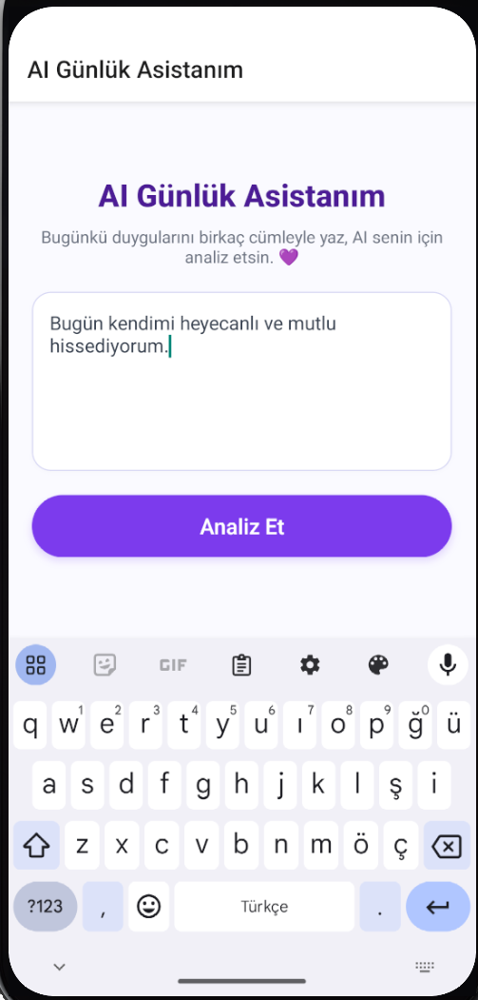
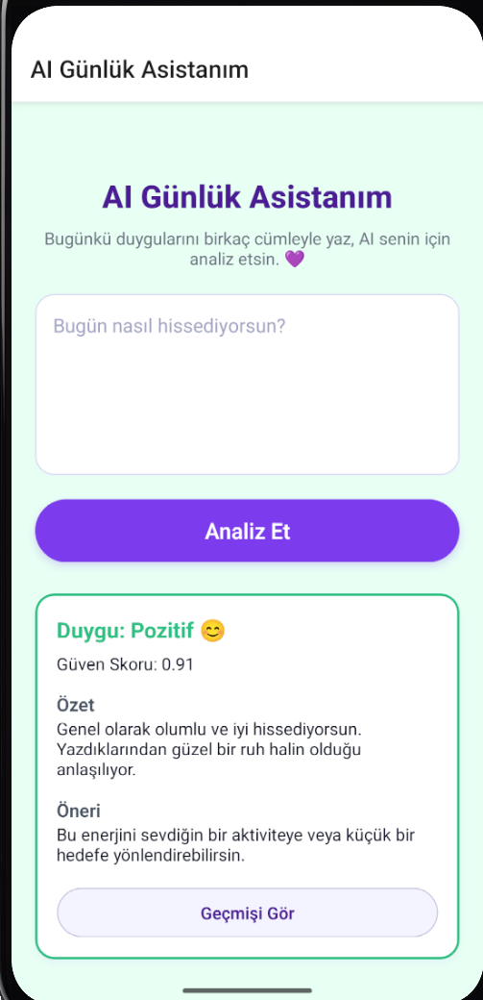
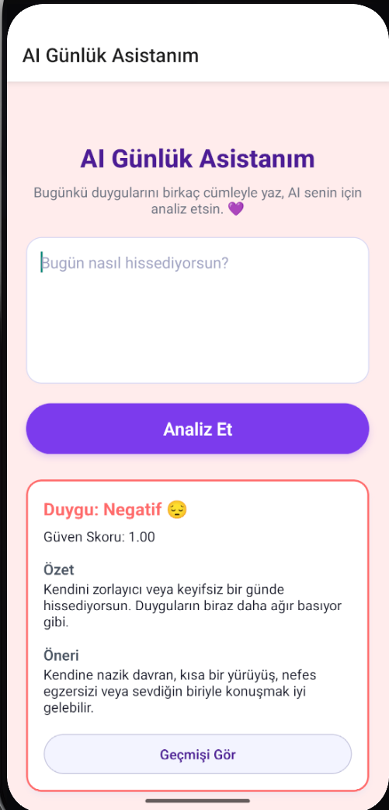
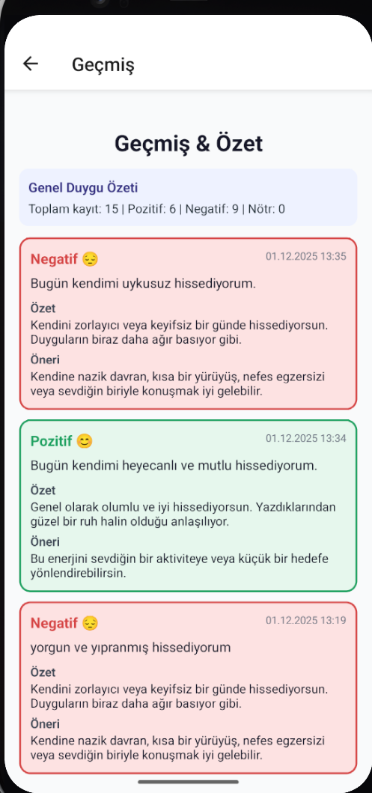

# **AI Günlük Asistanım**

Duygularını analiz eden, özet çıkaran ve sana kişisel öneriler sunan yapay zekâ destekli günlük uygulaması.

---

## Uygulama Hakkında

**AI Günlük Asistanım**, kullanıcıların hislerini analiz eden ve:

* Duygu Analizi
* Özetleme
* Kişisel öneri üretimi
* Geçmiş kayıtları görüntüleme

özellikleri sunan bir mobil uygulamadır.

Uygulama **React Native CLI** kullanılarak geliştirilmiştir.
Geçmiş kayıtlar cihaz içinde **AsyncStorage** ile saklanır.

---

## Kullanılan AI Modeli ve API Açıklaması

Uygulamada duygu analizi için **HuggingFace Inference API** kullanılmıştır.

### Kullanılan Model

```
distilbert/distilbert-base-uncased-finetuned-sst-2-english
```

Model çıkışı örneği:

```json
[
  {
    "label": "POSITIVE",
    "score": 0.98
  }
]
```

Modelin sonucuna göre:

* Pozitif
* Negatif
* Nötr

etiketleri belirlenir ve özet + öneri üretilir.

### ChatGPT Kullanımı (Geliştirme Desteği)

Kod düzenleme, hata çözümleme ve açıklama oluşturma süreçlerinde **ChatGPT** destek aracı olarak kullanılmıştır.

---

## AI Araç Kullanım Dokümantasyonu

| Araç            | Kullanım Amacı                              |
| --------------- | ------------------------------------------- |
| ChatGPT         | Kod geliştirme, hata çözümü, stil düzenleme |
| HuggingFace API | Duygu analizi modeli                        |

---

## Özellikler

* Türkçe duygu analizi
* Özet çıkarma
* Kullanıcıya özel öneri üretimi
* Geçmiş kayıtları listeleme
* Offline görüntüleme desteği
* Modern pastel arayüz tasarımı

---

## Kullanılan Teknolojiler

* React Native CLI
* HuggingFace Inference API
* AsyncStorage
* Android Studio

---

## Proje Yapısı

```
AI-Gunluk-Asistanim/
│
├── android/
├── ios/
├── node_modules/
│
├── assets/
│   └── images/
│       ├── history_list.png
│       ├── home_empty.png
│       ├── home_filled.png
│       ├── home_filled2.png
│       ├── result_negative.png
│       ├── result_positive.png
│
├── src/
│   ├── screens/
│   │   ├── HomeScreen.js
│   │   ├── HistoryScreen.js
│   ├── api.js
│   ├── config.local.js
│
├── App.js
├── index.js
├── package.json
├── README.md
```

---

## Kurulum

### 1. Bağımlılıkları yükleyin

```sh
npm install
```

### 2. Android ortamını başlatın

```sh
npx react-native start
npx react-native run-android
```

### 3. HuggingFace API anahtarı ekleyin

Token oluşturun:
[https://huggingface.co/settings/tokens](https://huggingface.co/settings/tokens)

`config.local.js` içine ekleyin:

```js
export const HUGGINGFACE_API_KEY = "your_api_key_here";
```

---

## Uygulama Ekran Görüntüleri

### Ana Sayfa 


### Metin Girişi

  


### Pozitif Sonuç



### Negatif Sonuç



### Geçmiş Sayfası



---

## Geliştirici

**Yağmur Geyik**
Bilgisayar Mühendisliği öğrencisi
NLP ve Yapay Zekâ alanına ilgi duyuyor.
Mobil uygulama geliştirme üzerine çalışıyor.

---

## Staj Projesi

Bu uygulama, *React Native AI Staj Programı* kapsamında geliştirilmiştir.
Tamamlanan gereksinimler:

* Türkçe duygu analizi
* Özet + öneri sistemi
* Geçmiş listeleme
* Modern UI
* Offline görüntüleme

---

## Lisans

Bu proje eğitsel amaçlarla geliştirilmiştir.
